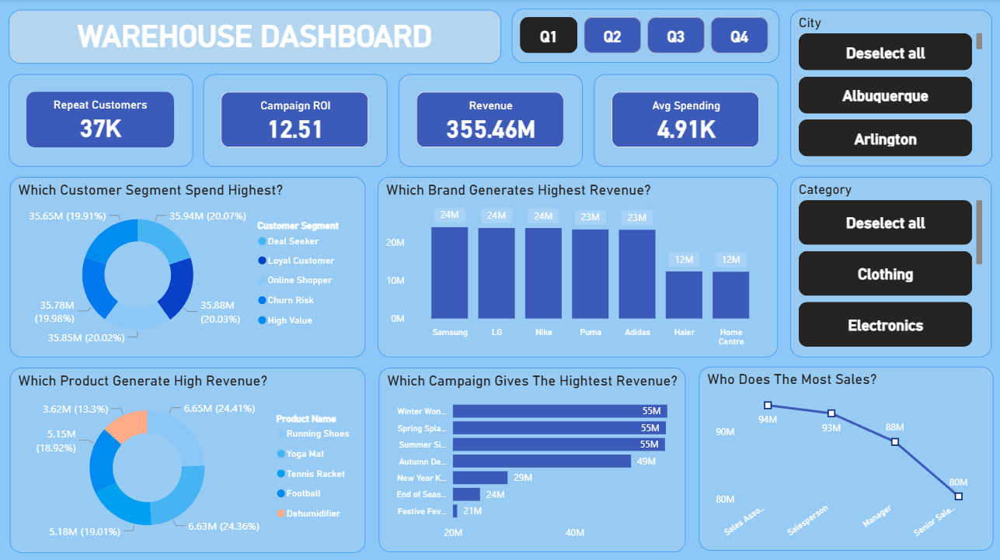
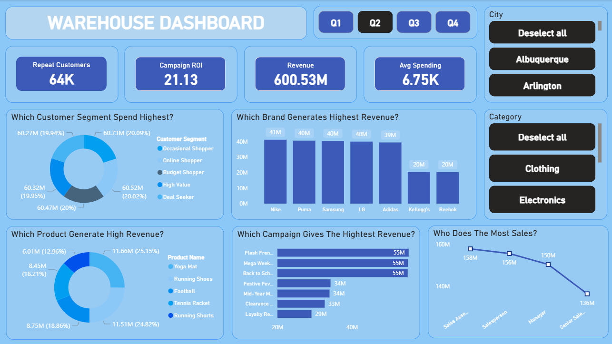
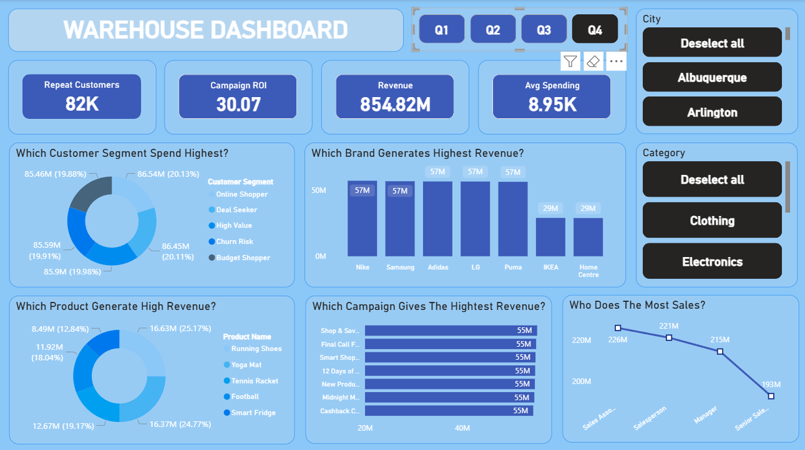
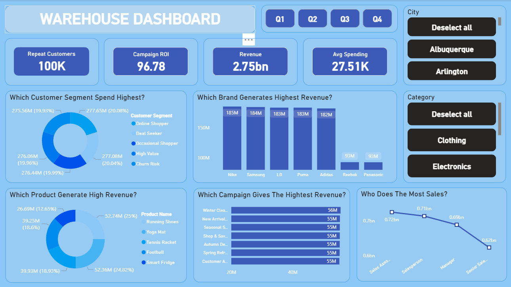

# 📊 Introduction

This project focuses on **Warehouse Sales Analysis** using SQL and Power BI. I imported raw CSV data into a database, cleaned and structured it, and performed analysis using SQL queries.

The project covers **Customer Analysis, Campaign Analysis, and Sales Performance**, with insights presented through an interactive Power BI dashboard. It demonstrates an end-to-end workflow from data loading to business-focused visualization.

# 📌 Background

Driven by the goal of understanding warehouse performance and improving business decision-making, this project was developed to analyze sales trends, customer behavior, and operational efficiency in a structured and data-driven way. The objective was to transform raw transactional CSV data into meaningful insights using SQL and present them through an interactive Power BI dashboard.

The dataset includes detailed records of customers, products, sales transactions, campaigns, stores, and salespersons. The analysis is organized into the following structured modules:
## 📂 SQL Analysis Structure
- [Business Analysis](sql_analysis/business_intelligence_and_decision-making_questions)
- [Customer Analysis](./sql_analysis/customer_analysis)  
- [Product Analysis](./sql_analysis/product_analysis)  
- [Campaign Analysis](./sql_analysis/campaign_analysis)
- [Sales Analysis](sql_analysis/sales_perfomance_analysis)
- [Salespersons Analysis](./sql_analysis/salespersons_analysis)  
- [Store Analysis](./sql_analysis/store_analysis)
- [Time & Trend](sql_analysis/time-based_trend_analysis)

# 🛠 Tools I Used

- **SQL**: Performed data analysis and answered business questions across customers, products, campaigns, stores, and salespersons.
- **PostgreSQL**: Managed and stored warehouse data imported from CSV files.
- **SQL Server Management Studio (SSMS) 22**: Used to manage the SQL Server environment and connect the database with Power BI.
- **Power BI**: Built an interactive dashboard to visualize sales performance and key insights.
- **Visual Studio Code**: Wrote and executed SQL queries.
- **Git & GitHub**: Handled version control and project documentation.

# The Analysis
## 📊 Quarter 1 

### 👥 Customer Performance
- Repeated Customers: **~37K**
- Average Spending per Customer: **$4.91K**
- Strong customer retention and high purchase value observed.

### 💰 Revenue & ROI
- Total Revenue: **$355.6 Million**
- Highest Campaign ROI: **12.12**
- Indicates strong marketing efficiency.

### 🧩 Top Customer Segments
- Deal Seekers
- Loyal Customers
- Online Shoppers
- Churn Risk
- High-Value Customers

### 🏷️ Top Performing Brands
- Samsung
- LG
- Nike
- Puma
- Adidas

### 📦 Best-Selling Products
- Running Shoes
- Yoga Mats
- Tennis Rackets
- Footballs

### 📢 Successful Marketing Campaigns
- Winter Wonder Sales
- Spring Splash
- Summer Promo
- Autumn Deals Drive

### 👔 Sales Team Performance
- Sales Associates
- Salespersons
- Managers
- Senior Salesmen

## 📈 Quarter 2
### 👥 Customer Performance
- Repeated Customers: **~64K** 
- Average Spending per Customer: **$6.75K**  
- Significant growth in repeat customers and spending.

### 💰 Revenue & ROI
- Total Revenue: **$600.53 Million**
- Highest Campaign ROI: **21.13** 

### 🧩 Top Customer Segments
- Occasional Shoppers  
- Online Shoppers  
- Budget Shoppers  
- High-Value Customers  
- Deal Seekers  

### 🏷️ Top Performing Brands
- Nike  
- Puma  
- Samsung  
- LG  
- Adidas  

### 📦 Best-Selling Products
- Yoga Mats  
- Running Shoes  
- Footballs  
- Tennis Rackets  
- Running Sports Gear  

### 📢 Successful Marketing Campaigns
- Flash Frenzy Friday  
- Mega Weekend Bonanza  
- Back to School Boost  

### 👔 Sales Team Performance
- Sales Associates  
- Salespersons  
- Managers  

## 📈 Quarter 3
### 👥 Customer Performance
- Repeated Customers: **~85K**  
- Average Spending per Customer: **$9.72K**  
- Highest customer engagement and spending across the year.

### 💰 Revenue & ROI
- Total Revenue: **$940.06 Million**
- Highest Campaign ROI: **33.07**  
- **Best-performing quarter** in terms of revenue and profitability.

### 🧩 Top Customer Segments
- Occasional Shoppers  
- Online Shoppers  
- Deal Seekers  
- Joint Risk  
- Loyal Customers  

### 🏷️ Top Performing Brands
- Samsung  
- Nike  
- LG  
- Puma  

### 📦 Best-Selling Products
- Running Shoes  
- Yoga Mats  
- Tennis Rackets  
- Footballs  
- Tennis Shoes  

### 📢 Successful Marketing Campaigns
- Super Saving Week  
- Weekend Worrior Specials  
- Price Drop Parade  
- Black Friday Blowout  
- Birthday Bash Sales  
- Exclusive Insider Offers  
- Customer Appreciation Week  

> ***These campaigns played a major role in making Quarter 3 the highest revenue-generating quarter of the year.***

### 👔 Sales Team Performance
- Sales Executives  
- Salespersons  
- Managers  
- Senior Sales  

## 📈 Quarter 4
### 👥 Customer Performance
- Repeated Customers: **~82K**  
- Average Spending per Customer: **$8.95K**  
- Strong customer retention and high spending maintained.

### 💰 Revenue & ROI
- Total Revenue: **$854.82 Million**  
- Highest Campaign ROI: **30.07**  
- Consistent and profitable campaign performance.

### 🧩 Top Customer Segments
- Online Shoppers(**20.13%**)  
- Deal Seekers (**20.11%**) 
- High-Value Customers(**19.98%**)  
- Churn Risk(**19.91%**)
- Budget Shopper(**19.88%**)  

### 🏷️ Top Performing Brands
- Nike(**57 Million**)
- Samsung(**57 Million**)  
- Adidas(**57 Million**) 
- LG(**57 Million**)  
- Puma(**57 Million**) 
- IKEA(**29 Million**)  

### 📦 Best-Selling Products
- Running Shoes(**25.17%**) 
- Yoga Mats(**24.77%**)
- Tennis Rackets(**19.17%**)  
- Footballs(**18.04%**) 
- Smart Fridge(**12.84%**)  

### 📢 Successful Marketing Campaigns
- Shop and Save Spectacular  
- Final Call Frenzy  
- Smart Shopper Weeks  
- 12 Days of Deals  
- New Product Launch Promo  
- Midnight Madness  
- Cashback Carnival  

> Each campaign received a similar investment of approximately **$54M–$55M**, ensuring balanced and consistent market exposure.

### 👔 Sales Team Performance
- Sales Associates(**226 Million**)  
- Salespersons(**221 Million**)
- Managers(**215 Million**)  
- Senior Salespersons(**193 Million**)

## 📌 Yearly Conclusion (2024 Performance Summary)
### 👥 Overall Customer & Sales Performance
- Best Performers: **Sales Associates**
- Top Performing City: Louisville (Highest Sales Contribution **with $71.46Million**)  
- Repeated Customers: ~**100K** 
- Indicates strong customer loyalty and sales execution.

### 💰 Financial Highlights
- Total Revenue (2024): **$2.7 Billion** 
- Total Campaign ROI: **96.78**  
- Average Customer Spending (Yearly): **$27.15K**  
- Demonstrates strong profitability and consistent growth.

### 🏷️ Best Performing Brands
Top revenue-generating brands:
- Nike(**$185Million**)
- Samsung(**$184Million**)  
- LG(**$183Million**)  
- Puma(**$183Million**)  

### 📦 Best Performing Products
Most successful products of the year:
- Running Shoes  
- Yoga Mats  
- Tennis Rackets  
- Footballs  
- Tennis Shoes  

### 📈 Best Performing Quarter
- Quarter 3 was the top-performing quarter of the year.
- Revenue Generated: **$940.06 Million**  
- Driven by **high ROI campaigns, strong customer engagement, and effective sales strategies**.

## 📉 Underperformance Analysis (Quarter 1 – Weak Performance Review)
### 📌 Overview
Quarter 1 was identified as the weakest-performing quarter of the year, with comparatively low revenue, limited campaign investment, and weaker customer engagement.

### 🏷️ Low-Performing Brands
Brands generating the lowest revenue in Quarter 1:
- Godrej Interio  
- Amul
- Decathlon  
- Apple  
- Nestlé  
- Sony  
- Revenue Range: **$11.5M – $11.7M**  
- Indicates limited brand contribution during this quarter.
- 
### 💰 Campaign Investment
- Average Campaign Budget: ~**$200K**  
- Low investment resulted in reduced market reach and weaker campaign impact.

### 📦 Low-Performing Products
Products with minimal revenue contribution:
- Training Shorts  
- Nestlé Cornflakes  
- Adidas Three Stripes  
- Revenue Range: **$1.54M – $1.56M**
- Shows low customer demand for these products.

### 🧩 Underperforming Customer Segments
Customer segments with low purchasing activity:
- In-Store Regulars  
- Occasional Shoppers  
- First-Time Buyers  
- These segments showed low engagement and spending behavior.

### 👔 Sales Team Performance
- Senior Sales Executives recorded the lowest sales.
- Revenue Contribution: ~**$80.4M** 
- Indicates the need for performance improvement and training.

### 🌍 Low-Performing City
- City: Chicago  
- Revenue: **$33.25M**  
- Lowest regional contribution in Quarter 1.

)

## ✅ Final Summary
The year 2024 showed outstanding business performance with strong customer retention, high campaign efficiency, and steady revenue growth. Quarter 3 emerged as the strongest quarter, supported by impactful campaigns and top-performing sales teams. Continued focus on high-value customers, leading brands, and successful product categories will help sustain future growth.

Quarter 1 underperformed due to low campaign investment, weak product demand, and limited customer engagement. Increasing marketing budgets, improving product positioning, and strengthening sales team performance can help enhance future results.
